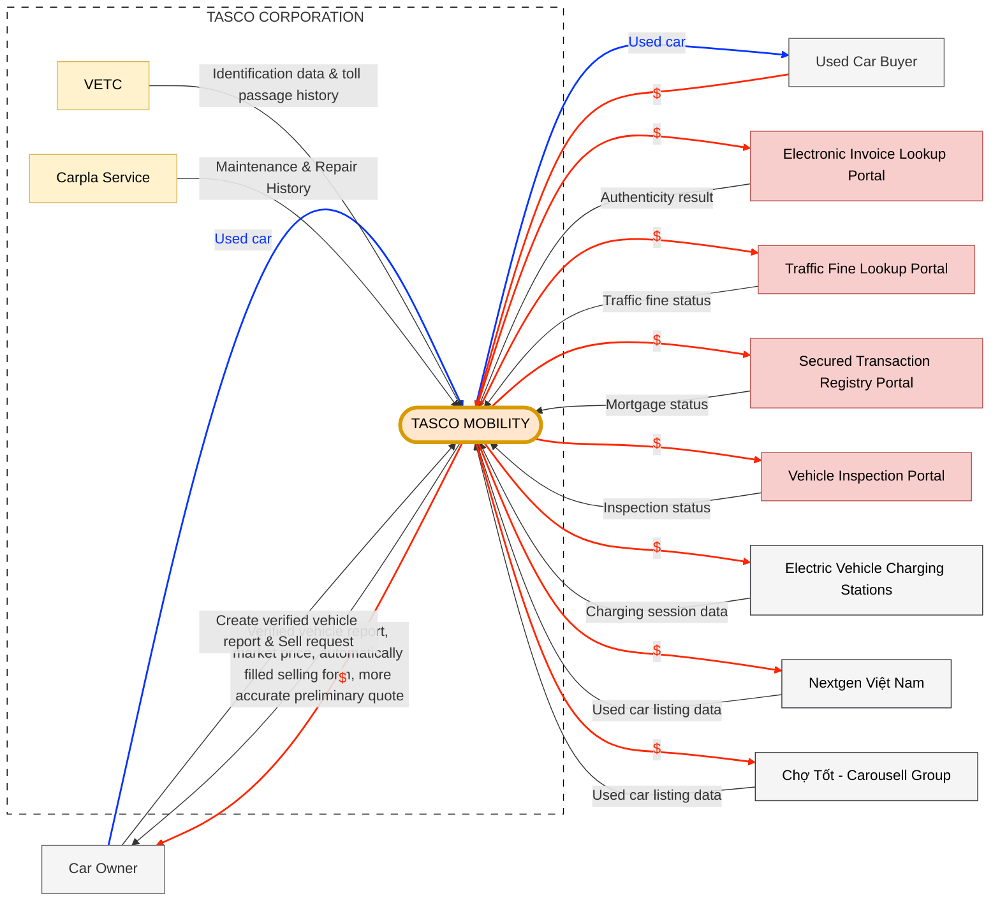

```mermaid 
flowchart LR
   CO["Car Owner"]
   BUYER["Used Car Buyer"]
   subgraph TASCO["TASCO CORPORATION"]
       direction TB
       VETC["VETC"]
       CS["Carpla Service"]
       MOB(["TASCO MOBILITY"])
   end
   INV["Electronic Invoice Lookup Portal"]
   FINE["Traffic Fine Lookup Portal"]
   REG["Secured Transaction Registry Portal"]
   INSP["Vehicle Inspection Portal"]
   EV["Electric Vehicle Charging Stations"]
   NEXT["Nextgen Việt Nam"]
   CHO["Chợ Tốt - Carousell Group"]
   CO -->|"Used car"| MOB
   VETC -->|"Identification data & toll passage history"| MOB
   CS -->|"Maintenance & Repair History"| MOB
   MOB -->|"Verified vehicle report, market price, automatically filled selling form, more accurate preliminary quote"| CO
   MOB -->|"$"| CO
   MOB -->|"Used car"| BUYER
   INV -->|"Authenticity result"| MOB
   CO -->|"Create verified vehicle report & Sell request"| MOB
   MOB -->|"$"| INV
   EV -->|"Charging session data"| MOB
   FINE -->|"Traffic fine status"| MOB
   MOB -->|"$"| FINE
   MOB -->|"$"| REG
   REG -->|"Mortgage status"| MOB
   BUYER -->|"$"| MOB
   INSP -->|"Inspection status"| MOB
   MOB -->|"$"| INSP
   MOB -->|"$"| EV
   NEXT -->|"Used car listing data"| MOB
   CHO -->|"Used car listing data"| MOB
   MOB -->|"$"| NEXT
   MOB -->|"$"| CHO
   classDef ext fill:#f5f5f5,stroke:#666666,color:#333333;
   classDef tasco fill:#fff2cc,stroke:#d6b656,color:#000000;
   classDef main fill:#ffe6cc,stroke:#d79b00,stroke-width:4px,color:#000000;
   classDef gov fill:#f8cecc,stroke:#b85450,color:#000000;
   classDef partner fill:#f5f5f5,stroke:#36393d,color:#000000;
   class CO,BUYER ext;
   class VETC,CS tasco;
   class MOB main;
   class INV,FINE,REG,INSP gov;
   class EV,NEXT,CHO partner;
   style TASCO fill:none,stroke:#000000,stroke-dasharray:8 8
   %% Xanh = thong tin: 0,5 | Do = tien: 4,8,11,12,14,16,17,20,21 | con lai = san pham (den)
   linkStyle 0,5 stroke:#0433ff,stroke-width:2px,color:#0433ff
   linkStyle 4,8,11,12,14,16,17,20,21 stroke:#ff2600,stroke-width:2px,color:#ff2600  
```

