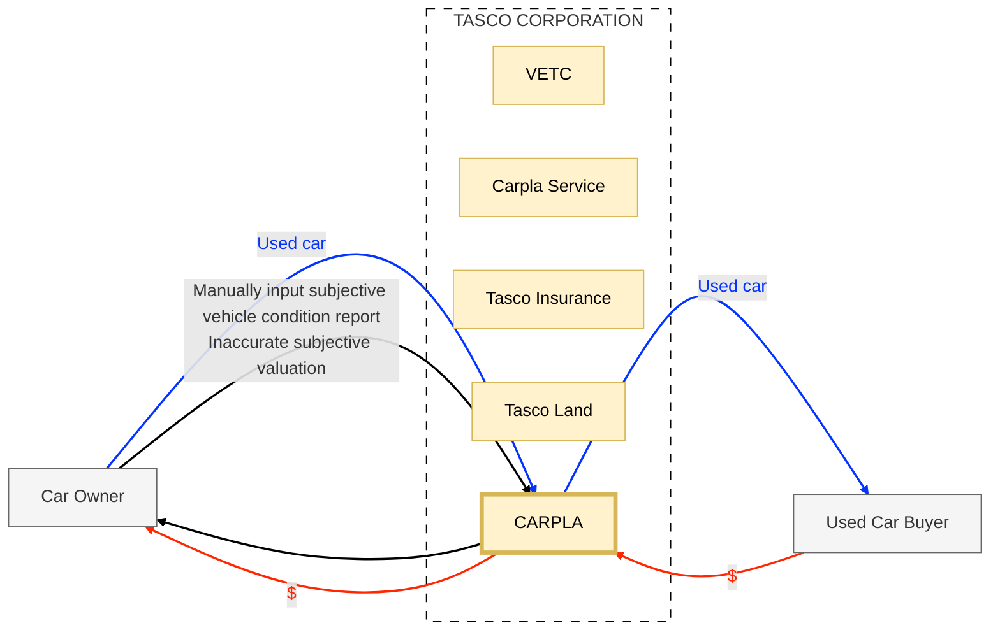

```mermaid
flowchart LR
   CO["Car Owner"]
   BUYER["Used Car Buyer"]
   subgraph TASCO["TASCO CORPORATION"]
       direction TB
       VETC["VETC"]
       CS["Carpla Service"]
       INS["Tasco Insurance"]
       LAND["Tasco Land"]
       CARPLA["CARPLA"]
   end
   CO -->|"Used car"| CARPLA
   CARPLA --> CO
   CO -->|"Manually input subjective vehicle condition report<br/>Inaccurate subjective valuation"| CARPLA
   CARPLA -->|"Used car"| BUYER
   BUYER -->|"$"| CARPLA
   CARPLA -->|"$"| CO
   classDef ext fill:#f5f5f5,stroke:#666666,color:#333333;
   classDef tasco fill:#fff2cc,stroke:#d6b656,color:#000000;
   classDef main fill:#fff2cc,stroke:#d6b656,stroke-width:4px,color:#000000;
   class CO,BUYER ext;
   class VETC,CS,INS,LAND tasco;
   class CARPLA main;
   style TASCO fill:none,stroke:#000000,stroke-dasharray:8 8
   %% Xanh = thong tin: 0,3 | Den = san pham: 1,2 | Do = tien: 4,5
   linkStyle 0,3 stroke:#0433ff,stroke-width:2px,color:#0433ff
   linkStyle 1,2 stroke:#000000,stroke-width:2px
   linkStyle 4,5 stroke:#ff2600,stroke-width:2px,color:#ff2600
```

