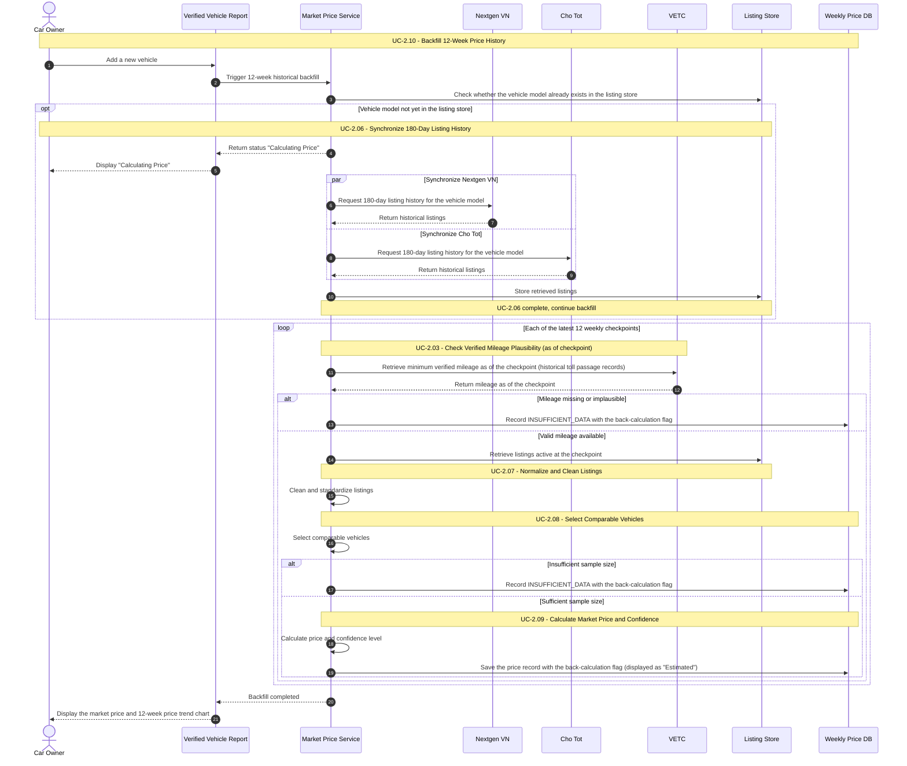

```mermaid 
sequenceDiagram
    autonumber
    actor Owner as Car Owner
    participant App as Verified Vehicle Report
    participant MP as Market Price Service
    participant NG as Nextgen VN
    participant CT as Cho Tot
    participant VETC as VETC
    participant LDB as Listing Store
    participant PDB as Weekly Price DB

    Note over Owner,PDB: UC-2.10 - Backfill 12-Week Price History
    Owner->>App: Add a new vehicle
    App->>MP: Trigger 12-week historical backfill
    MP->>LDB: Check whether the vehicle model already exists in the listing store
     
    opt Vehicle model not yet in the listing store
    Note over Owner,LDB: UC-2.06 - Synchronize 180-Day Listing History
        MP-->>App: Return status "Calculating Price"
        App-->>Owner: Display "Calculating Price"

       
        par Synchronize Nextgen VN
            MP->>NG: Request 180-day listing history for the vehicle model
            NG-->>MP: Return historical listings
        and Synchronize Cho Tot
            MP->>CT: Request 180-day listing history for the vehicle model
            CT-->>MP: Return historical listings
        end

        MP->>LDB: Store retrieved listings
        Note over MP,LDB: UC-2.06 complete, continue backfill 
    end

    loop Each of the latest 12 weekly checkpoints
              Note over MP,VETC: UC-2.03 - Check Verified Mileage Plausibility (as of checkpoint)
        MP->>VETC: Retrieve minimum verified mileage as of the checkpoint (historical toll passage records)
        VETC-->>MP: Return mileage as of the checkpoint

        alt Mileage missing or implausible
            MP->>PDB: Record INSUFFICIENT_DATA with the back-calculation flag
        else Valid mileage available
            MP->>LDB: Retrieve listings active at the checkpoint
            Note over MP,LDB: UC-2.07 - Normalize and Clean Listings 
            MP->>MP: Clean and standardize listings
            Note over MP,PDB: UC-2.08 - Select Comparable Vehicles 
            MP->>MP: Select comparable vehicles

            alt Insufficient sample size
                MP->>PDB: Record INSUFFICIENT_DATA with the back-calculation flag
            else Sufficient sample size
                Note over MP,PDB: UC-2.09 - Calculate Market Price and Confidence 
                MP->>MP: Calculate price and confidence level
                MP->>PDB: Save the price record with the back-calculation flag (displayed as "Estimated")
            end
        end
    end

    MP-->>App: Backfill completed
    App-->>Owner: Display the market price and 12-week price trend chart
```

